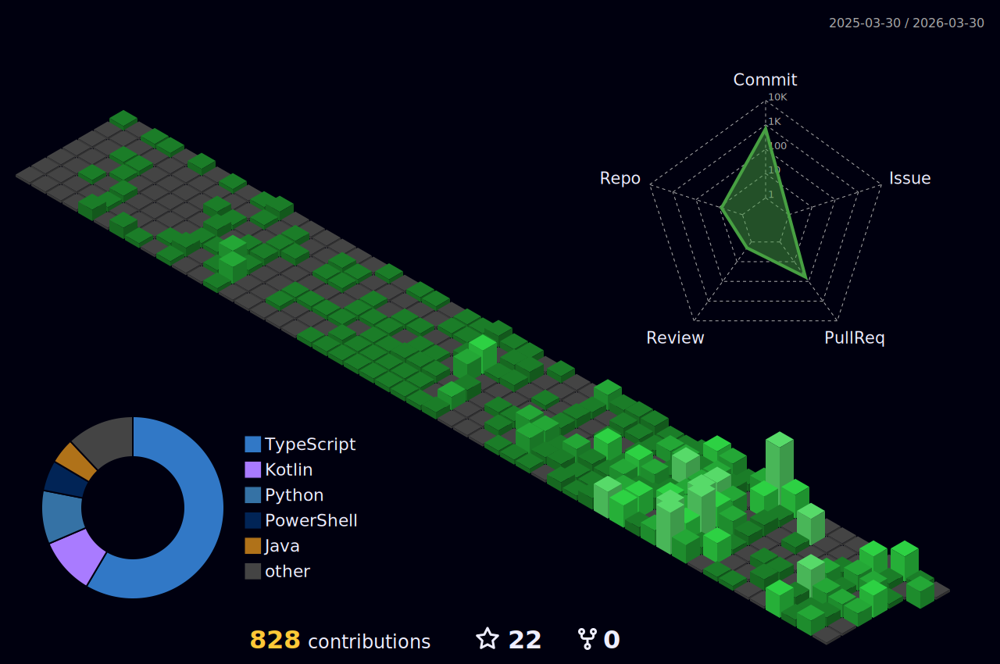

## ✨ Welcome! But there is nothing here...

```yml
⠀⠀⠀⠀⠠⠤⠤⠤⠤⠤⣤⣤⣤⣄⣀⣀⠀⠀⠀⠀⠀⠀⠀⠀⠀⠀⠀⠀⠀⠀⠀⠀⠀⠀⠀⠀⠀⠀⠀   $ longto@nautius:⠀
⠀⠀⠀⠀⠀⠀⠀⠀⠀⠀⠀⠀⠀⠉⠉⠛⠛⠿⢶⣤⣄⡀⠀⠀⠀⠀⠀⠀⠀⠀⠀⠀⠀⠀⠀⠀⠀⠀⠀⠀   ----------------------
⠀⢀⣀⣀⣠⣤⣤⣴⠶⠶⠶⠶⠶⠶⠶⠶⠶⠿⠿⢿⡇⠀⠀⠀⠀⠀⠀⠀⠀⠀⠀⠀⠀⠀⠀⠀⠀⠀    Name: Long To
⠚⠛⠉⠉⠉⠀⠀⠀⠀⠀⠀⢀⣀⣀⣤⡴⠶⠶⠿⠿⠿⣧⡀⠀⠀⠀⠤⢄⣀⠀⠀⠀⠀⠀⠀⠀⠀⠀⠀    Role: Undergraduate student @ CS
⠀⠀⠀⠀⠀⠀⠀⢀⣠⡴⠞⠛⠉⠁⠀⠀⠀⠀⠀⠀⠀⢸⣿⣷⣶⣦⣤⣄⣈⡑⢦⣀⠀⠀⠀⠀⠀⠀⠀⠀    Focus: Creative code / Inventions
⠀⠀⠀⠀⣠⠔⠚⠉⠁⠀⠀⠀⠀⠀⠀⠀⠀⠀⠀⢀⣾⡿⠟⠉⠉⠉⠉⠙⠛⠿⣿⣮⣷⣤⠀⠀⠀⠀⠀⠀     Language: Python / Javascript / Java
⠀⠀⠀⠀⠀⠀⠀⠀⠀⠀⠀⠀⠀⠀⠀⠀⠀⠀⢀⣿⡿⠁⠀⠀⠀⠀⠀⠀⠀⠀⠀⠉⢻⣯⣧⡀⠀⠀⠀⠀        Editor: VS Code / Sublime
⠀⠀⠀⠀⠀⠀⠀⠀⠀⠀⠀⠀⠀⠀⠀⠀⠀⠀⢸⣿⡇⠀⠀⠀⠀⠀⠀⠀⠀⠀⠀⠀⠀⠉⠻⢷⡤⠀⠀⠀         Professions: WebDev / Multi-agent / Automation
⠀⠀⠀⠀⠀⠀⠀⠀⠀⠀⠀⠀⠀⠀⠀⠀⠀⠀⠈⢿⣿⡀⠀⠀⠀⠀⠀⠀⠀⠀⠀⠀⠀⠀⠀⠀⠀⠀⠀⠀           OS: Windows / Kali Linux
⠀⠀⠀⠀⠀⠀⠀⠀⠀⠀⠀⠀⠀⠀⠀⠀⠀⠀⠀⠈⠻⣿⣦⣤⣀⡀⠀⠀⠀⠀⠀⠀⠀⠀⠀⠀⠀⠀⠀⠀           Trait: Curious / Minimalist / Self-starter / Fast learner
⠀⠀⠀⠀⠀⠀⠀⠀⠀⠀⠀⠀⠀⠀⠀⠀⠀⠀⠀⠀⠀⠀⠉⠙⠛⠛⠻⠿⠿⣿⣶⣶⣦⣄⣀⠀⠀⠀⠀⠀          Style: Dark theme / Minimal / Clean code
⠀⠀⠀⠀⠀⠀⠀⠀⠀⠀⠀⠀⠀⠀⠀⠀⠀⠀⠀⠀⠀⠀⠀⠀⠀⠀⠀⠀⠀⠀⠉⠻⣿⣯⡛⠻⢦⡀⠀⠀          Interest: Instrument / Digital art
⠀⠀⠀⠀⠀⠀⠀⠀⠀⠀⠀⠀⠀⠀⠀⠀⠀⠀⠀⠀⠀⠀⠀⠀⠀⠀⠀⠀⠀⠀⠀⠀⠈⠙⢿⣆⠀⠙⢆⠀          Belief: Build > Talk | Quality > Quantity
⠀⠀⠀⠀⠀⠀⠀⠀⠀⠀⠀⠀⠀⠀⠀⠀⠀⠀⠀⠀⠀⠀⠀⠀⠀⠀⠀⠀⠀⠀⠀⠀⠀⠀⠈⢻⣆⠀⠈⢣         Goal: Work and build revolutionary techonologies
⠀⠀⠀⠀⠀⠀⠀⠀⠀⠀⠀⠀⠀⠀⠀⠀⠀⠀⠀⠀⠀⠀⠀⠀⠀⠀⠀⠀⠀⠀⠀⠀⠀⠀⠀⠀⠻⡆⠀⠈        --------------
⠀⠀⠀⠀⠀⠀⠀⠀⠀⠀⠀⠀⠀⠀⠀⠀⠀⠀⠀⠀⠀⠀⠀⠀⠀⠀⠀⠀⠀⠀⠀⠀⠀⠀⠀⠀⠀⢻⡀⠀       ----------
⠀⠀⠀⠀⠀⠀⠀⠀⠀⠀⠀⠀⠀⠀⠀⠀⠀⠀⠀⠀⠀⠀⠀⠀⠀⠀⠀⠀⠀⠀⠀⠀⠀⠀⠀⠀⠀⠈⠃⠀⠀⠀⠀   -----⠀⠀⠀⠀⠀⠀⠀⠀⠀⠀⠀⠀⠀⠀⠀⠀⠀⠀⠀⠀
```


## 📊 My Github stats

[](https://github.com/longtoZ/github-readme-stats)
[](https://github.com/longtoZ/github-readme-stats)
